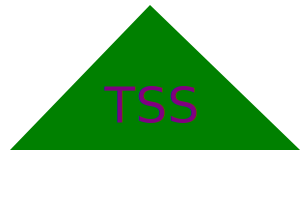

# SVG Logo Maker

  
  ## Table of Contents

  - [Description](#description)
  - [Installation](#installation)
  - [Usage](#usage)
  - [Contributions](#contributions)
  - [Tests](#tests)
  - [License](#license)
  - [Questions](#questions)
  
  ## Description

  This command line application allows a user to make a simple, 3 character, 1 shape logo of their desired color.

  ## Installation
  
  This application will require an "npm install".

  ## Usage

  Once all dependencies are installed, input "node index.js" into your terminal and answer the given prompts.

  ## Video Demo Link
  https://drive.google.com/file/d/142T6foIaLbYIsrXDqxqqhD4xYj52k3U8/view

  ## Contributions
  
  N/A

  ## Tests
  
  To run tests input "npm test" into the terminal
  

  ## License
  
  MIT
  

  ## Questions
  
  Have questions about this project? Contact me!
  Email me at: tshankgg@gmail.com,
  or find me on GitHub here: https://github.com/FirefoxFlareon